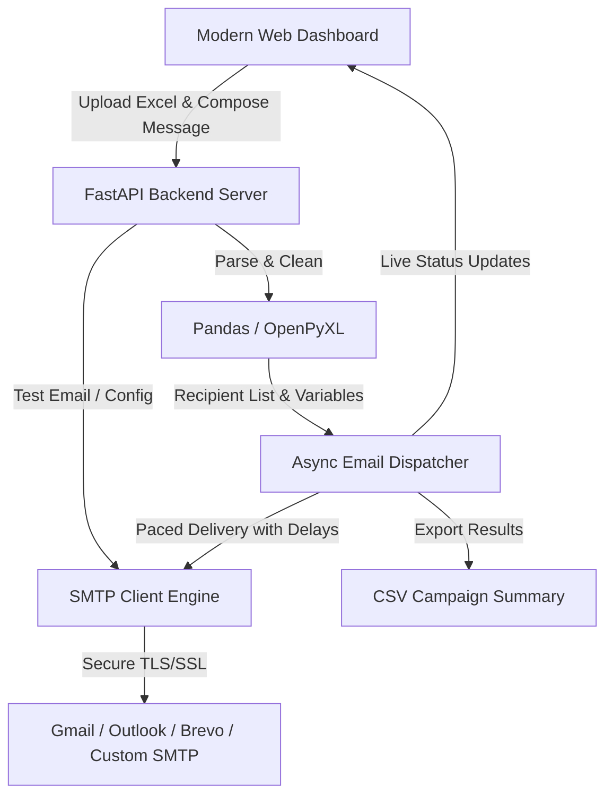

# Bulk Email Automation System (Excel to Bulk Email)

An automated, 100% free and open-source bulk email campaign dispatcher with an intuitive web dashboard, Excel file parsing, personalized variable templates (`{{Name}}`, `{{Company}}`), SMTP configuration, queue throttling, and live sending progress tracking.

---

## 1. Recommended Architecture & Free Tech Stack

| Layer | Technology | Why it's best & 100% Free |
| :--- | :--- | :--- |
| **Backend & Engine** | **Python (FastAPI + AsyncIO)** | Extremely fast, asynchronous non-blocking email worker, native background tasks, robust file processing. |
| **Data / Excel Processing**| **Pandas + OpenPyXL** | Handles `.xlsx`, `.xls`, `.csv` seamlessly for 10,000+ rows, handles empty cells and custom columns. |
| **Email Delivery** | **Python `smtplib` / `aiosmtplib`** | Standard SMTP protocol supporting any free provider (Gmail App Passwords, Outlook, Brevo, Resend, or company SMTP). |
| **Frontend UI** | **Modern Responsive Single Page Web App (Glassmorphic / Dark Mode)** | Drag-and-drop Excel upload, live recipient preview, dynamic column-based template tags, real-time dispatch progress bar, error log download. |

---

## 2. Key Features & Future-Proofing

1. **Excel / CSV Upload & Auto-Detection**:
   - Upload any `.xlsx` or `.csv` file.
   - Automatically detects the `Email` column and lists all other columns as dynamic merge tags (e.g. `{{Name}}`, `{{Company}}`, `{{Phone}}`).
   - Validates email formats and filters out duplicates or invalid syntax before sending.

2. **Personalized Email Composer**:
   - Dynamic subject line and rich body editor (supporting both Plain Text and HTML).
   - Click-to-insert placeholder tags (`{{Name}}`, etc.).
   - Test email button (send 1 sample preview email to yourself before starting the 1,000 bulk blast).

3. **Smart Rate Throttling & Spam Protection**:
   - Customizable delay (e.g., 2–5 seconds between emails or batch-sending) to prevent triggering spam filters, SMTP rate limits, or IP blacklisting.
   - Pause / Resume / Cancel execution at any time.

4. **Live Progress & Audit Logging**:
   - Real-time websocket or polling progress bar (Sent, Failed, Queued).
   - Live log terminal showing delivery response status for every recipient.
   - Downloadable CSV report of failed / successful emails.

5. **Free Sending Service (SMTP) Options**:
   - **Gmail with App Password**: Free 500 emails/day (standard personal accounts) or 2,000 emails/day (Google Workspace).
   - **Outlook / Office 365 / Zoho / Custom SMTP**: 100% free with existing credentials.
   - **Brevo / Resend / SendGrid free tiers**: Supported out of the box via SMTP credentials.

---

## 3. System Architecture Diagram

---

## 4. Proposed File Structure

- `backend/`
  - `main.py` — FastAPI application entry point, REST endpoints, and SSE/WebSocket for live progress.
  - `email_sender.py` — Async email queue worker, SMTP connection pool, rate limiting, and template replacement engine.
  - `excel_parser.py` — Excel/CSV parsing, email validation, and column mapping helper.
  - `config.py` — SMTP settings management and persistent campaign state.
  - `requirements.txt` — Python dependencies (`fastapi`, `uvicorn`, `pandas`, `openpyxl`, `aiosmtplib`, `pydantic`, `python-multipart`).
- `frontend/`
  - `index.html` — Modern, sleek UI with drag-and-drop file upload, template editor, recipient table, and live dispatch logs.
  - `style.css` — High-end dark/light glassmorphic styling.
  - `app.js` — Client logic, file parsing preview, template preview, and real-time campaign monitor.
- `run.bat` / `run.ps1` — One-click launcher script to run the local server and open the browser automatically.

---

## 5. Verification Plan

### Automated & Manual Verification
1. **Dependency Installation**: Verify Python virtual environment and required libraries.
2. **Excel Parsing Test**: Upload a test `.xlsx` file with custom columns (`Name`, `Email`, `Company`) and verify field extraction.
3. **Template Personalization Test**: Verify `{Name}` and `{Company}` tags are substituted accurately for each recipient.
4. **SMTP Connection & Test Send**: Send a test email to a target inbox to verify TLS/SSL connectivity and email formatting.
5. **Rate Limiting & Queue Execution**: Run a simulated batch run with logs and monitor progress updates.
